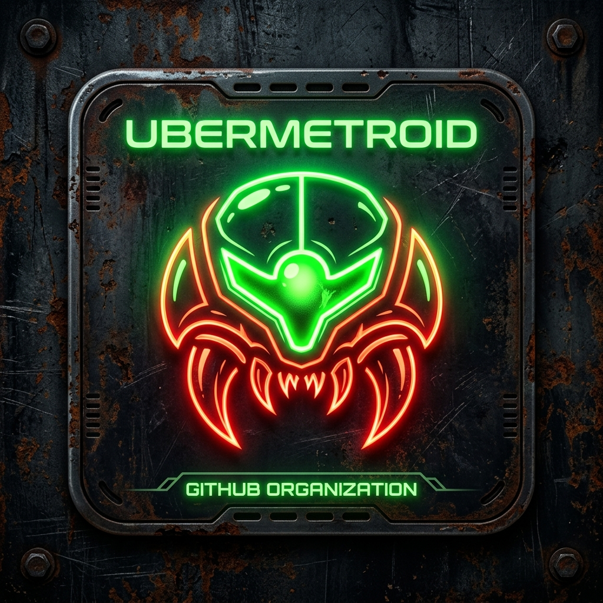

<h1 align="center">
   Shared Assets
</h1>

<p align="center">
  <b>Centralized design system tokens, CSS utilities, icons, and shared Rust crates for studio2201 applications.</b>
</p>

---

### Instant One-Line Install (Native Package Manager)

On Debian, Ubuntu, Fedora, or RHEL:

```bash
curl -fsSL https://studio2201.github.io/packages/install.sh | sudo bash
```

---

### Shared Sub-Crates & Assets

This repository provides reusable core building blocks for the entire studio2201 org:

- `shared-core`: Common data types, internationalization (i18n) tables, and domain validation.
- `shared-backend`: Axum security middleware, PIN authentication, CORS, HSTS, and rate-limiting.
- `shared-frontend`: Yew UI components, theme definitions, and CSS design system utilities.
- `styles/`: Global CSS design tokens, glassmorphism utilities, and color themes.

---

### Architecture & Security

- **Axum Security Middleware**: Standardized security headers, origin validation, and PIN brute-force protection.
- **Yew UI Design Tokens**: Harmonious color palettes and responsive layout components.
- **Zero-Dependency Rust Core**: High-efficiency shared logic compiled into all studio2201 applications.

---

### License

Distributed under the Apache 2.0 License. See [LICENSE](LICENSE) for details.

---

<p align="center">
  <a href="https://github.com/studio2201/shared-assets">
    
  </a>
</p>
